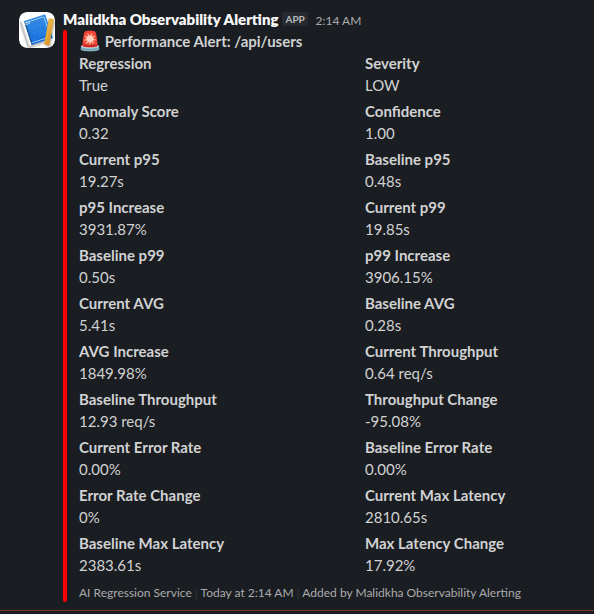
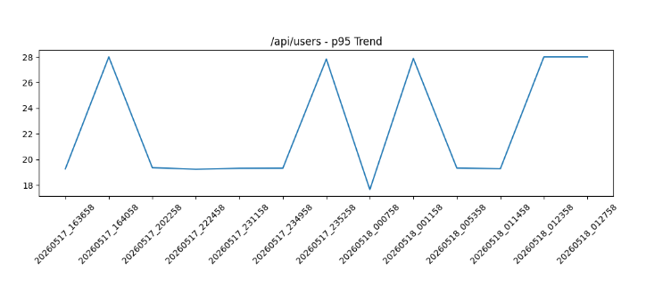

# 🤖 AI-Powered Performance Regression Anomaly Detection Pipeline

A containerized **AI-Powered performance observability and automated regression anomaly detection system** for PHP applications.

This repository combines:

- ⚡ Nginx + PHP-FPM service with 📊 Prometheus metrics
- 🔥 SPX profiling and flamegraph collection
- 🚨 Prometheus alerting and Alertmanager integration
- 🤖 AI-Powered anomaly and regression detection using historical metrics
- 📄 PDF reporting of baselines and regressions
- 🧪 k6 load testing workflows for baseline and regression simulation


This project is intended as a practical demo of how to wire **PHP request metrics**, **alerting**,  **dynamic profiler activation**,  **automatic regression detection** using **AI-powered anaomaly detection service** and **historical trend analysis & tracking** together into a reproducible Docker-based performance observability & automated regression detection pipeline.

## Summary

This project is designed to detect performance regressions automatically by combining metrics, historical trends, AI anomaly scoring, and profiling.

Instead of using fixed thresholds like `p95 > baseline * 1.3`, it learns from historical performance patterns and computes:

- **anomaly score**
- **regression decision**
- **severity**
- **confidence score**
- **z-score based on the route history**

It also triggers SPX profiling for slow endpoints and generates PDF reports for baselines and detected regressions.


## Architecture

### Services
The stack is composed of the following services:

- `nginx` — HTTP front-end for the PHP application, metrics, flamegraph UI, and SPX JSON assets
- `php` — PHP-FPM application with Prometheus instrumentation and SPX auto-trigger
- **`redis`** — Used by SPX trigger logic and baseline storage
- `prometheus` — Scrapes application, Nginx, and PHP-FPM metrics
- `alertmanager` — Routes alerts to the regression service via webhook
- `grafana` — Dashboarding (optional, not configured in repo)
- `php-fpm-exporter` — Exposes PHP-FPM metrics to Prometheus
- `nginx-exporter` — Exposes Nginx metrics to Prometheus
- **`ai-service`** — Python AI anomaly detection endpoint at `/detect` using **`IsolationForest`** ML model
- **`regression-service`** — Regression analysis service with `/baseline`, `/alert`, `/check`
- **`report-service`** — PDF report generator for baselines and regressions
- **`k6`** — Load testing and baseline generation runner

### Data flow

1. k6 or users hit the PHP app through Nginx
2. PHP app records Prometheus metrics
3. Prometheus scrapes metrics and evaluates alerts
4. Alertmanager POSTs matched alerts to **`regression-service`** `/alert`
5. **`regression-service`** queries Prometheus and history, forwards data to **`ai-service`**
6. **`ai-service`** returns anomaly/regression verdict
7. If regression is detected:
   - SPX profiling is triggered
   - Slack notification is sent
   - PDF regression report is generated


## Project Structure

```bash
├── docker-compose.yml          # Main orchestration
├── alertmanager/               # Alert routing
├── k6/                         # Load testing scripts
├── nginx/                      # Web server config
├── php/                        # PHP-FPM setup
├── prometheus/                 # Metrics config
├── regression-service/         # Python regression detector
├── ai-service/                 # Python AI-based anomaly detection service
├── report-service/             # Python PDF generator
├── src/                        # PHP application
├── reports/                    # Generated PDFs
├── spx-data/                   # Flamegraph storage
└── testing/                    # Test utilities
└──.env.example                 #sample environment configuration
```

## Prerequisites

- Docker
- Docker Compose

Optional:
- `K6` & `jq` (only if need to test locally with `/testing`)


## Quick start

**1. Prepare environment**

Copy the example env file:

```bash
cp .env.example .env
```

Update values as needed, especially **`SLACK_WEBHOOK`**.

**2. Start the full stack**

```bash
docker compose up -d --build
```

**3. Validate services**

```bash
curl http://localhost:5200/health # ai anomaly detection service
curl http://localhost:8090/health # regression service
curl http://localhost:5000/health # report service
```

**4. Generate baseline and run test scenarios**

The k6 service is configured to:

- warm up the app
- run baseline traffic
- collect Prometheus metrics
- send baseline snapshots to `regression-service`
- simulate slow requests (gradual degradations & spikes)

**Note**: k6 traffic is automatically triggered the first time the application is up (using `k6/entrypoint.sh`), so you do not need to do anything. 
You can however manually generate traffic locally using `testing/makefile` or Run the k6 entrypoint directly:

```bash
# Run the k6 entrypoint directly
docker compose run --rm k6
docker compose logs -f k6 # follow logs

# or locally
cd testing/
make test-ai-anomaly-detection
```

**5. Inspect reports and flamegraphs**

- Baseline and regression PDFs are written to `./reports`
- SPX JSON profiles are written to `./spx-data`
- Flamegraph browser is available at `http://localhost:8080/flamegraphs`
- Prometheus UI: `http://localhost:9090`
- Grafana UI: `http://localhost:3000`
- Alertmanager UI: `http://localhost:9093`


## Endpoints & Routes

### Service URLs
| Service | URL | Notes |
|---|---|---|
| PHP App | http://localhost:8080 | Main web app routes and `/flamegraphs` |
| Prometheus | http://localhost:9090 | Scrapes app and exporter metrics |
| Alertmanager | http://localhost:9093 | Receives alerts from Prometheus |
| Grafana | http://localhost:3000 | Dashboarding (not provisioned by default) |
| Regression Service | http://localhost:8090 | Baseline, alert, manual checks |
| AI anomaly service | http://localhost:5200 | evaluate route performance data |
| Report Service | http://localhost:5100 | PDF generation endpoints |
| SPX Web UI | http://localhost:8080/?SPX_KEY=dev&SPX_UI=1&SPX_UI_URI=/ | PHP-SPX Profiling Web UI


### Application routes

- `/` — home route
- `/api/users` — sample API route
- `/api/users?delay=<seconds>` — simulate slow requests

### Metrics and profiling

- `/metrics` — Prometheus metrics endpoint
- `/flamegraphs` — searchable SPX flamegraph list
- `/spx-data/` — raw SPX JSON profile output


### Services Endpoints

#### AI anomaly service (`:5200`)

- `POST /detect` — evaluate route performance data
- `GET /health`

#### Regression Service (`:8090`)

- `POST /baseline` - Store baseline metrics
- `POST /alert` - Handle Prometheus alerts
- `POST /check` - Manual regression check
- `GET /health` - Health check

#### Report Service (`:5100`)

- `POST /generate-baseline` - Generate baseline PDF report
- `POST /generate` - Generate regression PDF report
- `GET /health` - Health check


## How it works

### Baseline storage

The regression service stores baseline metrics in Redis using keys like `baseline:/api/users`.

### Alert handling

Alert rule: `SlowEndpoint` triggers when p95 latency > 1s for any route.

`Alertmanager` sends alerts (based on `P95`) to the regression service at `/alert`

### Regression service

Endpoints:

- `POST /baseline` — store route baseline metrics in Redis and generate baseline PDF
- `POST /alert` — handle incoming Prometheus alerts, compute current metrics, query history, and run AI detection
- `POST /check` — manually evaluate all stored baselines against current Prometheus metrics
- `GET /health` — health check

If a regression is detected, the service:

- triggers SPX profiling for the affected route
- sends Slack notification if `SLACK_WEBHOOK` is configured
- generates a PDF regression report via `report-service`

### AI anomaly service

The AI service exposes:

- `POST /detect` — evaluate route performance data
- `GET /health`

It builds a historical dataset from Prometheus time series and uses **`IsolationForest`** ML Model to classify the current observation.

Features used for anomaly detection:

- `p95`
- `p99`
- `avg`
- `throughput`
- `max_latency`

It also computes:

- anomaly score
- z-score for p95
- confidence score
- severity category (`LOW`, `MEDIUM`, `HIGH`, `CRITICAL`)


### SPX profiling & Flamegraphs

- SPX is enabled by the Nginx `fastcgi_param PHP_VALUE "auto_prepend_file=/var/www/html/spx_prepend.php"` setting.

- The file `src/spx_prepend.php` connects to Redis and enables profiling only when `spx:{route}` is set.

- The flamegraph browser is served by `src/flamegraphs.php` and static JSON files under `/spx-data`.


## Configuration

Use **`.env`** to configure runtime settings for the PHP app, k6, and services.

Important variables:

- `REDIS_HOST` — Redis service
- `NGINX_URL` — Nginx URL used by k6 and scripts
- `PROM_URL` — Prometheus URL used by k6
- `REPORT_URL` — report-service URL
- `REGRESSION_SERVICE_URL` — regression-service URL
- `SLACK_WEBHOOK` — Slack webhook for alert notifications


## Full Workflow

### General

k6 simulates:

- baseline traffic to generate the baseline
- slow endpoint traffic (?delay=) to trigger a regression

**Note**: k6 traffic is automatically triggered the first time the application is up (using `k6/entrypoint.sh`). You can also generate traffic locally using `testing/makefile`

```bash
0-15s    → warmup phase with 20 requests
15s-20s  → generate baseline
20-50s   → metrics accumulate
50-80s  → p95 increases
~80s    → alert enters "pending"
~140s   → alert fires
         ↓
         regression anomaly detected  →  AI Service
           ↓                                    ├── anomaly scoring
         slack alert                            ├── historical tracking
           ↓                                    ├── charts
         regression report generated            └── PDF reports
             ↓
next request → SPX profiling ON
         ↓
flamegraph generated
```

### Baseline generation workflow

1. k6 runs baseline traffic through `/` and `/api/users`
2. Prometheus scrapes the resulting metrics
3. `k6/entrypoint.sh` queries Prometheus for `p95`, `p99`, `avg`, `error_rate`, `max_latency`, and `throughput`
4. Baseline data is posted to `regression-service` `/baseline`
5. `report-service` generates a baseline PDF and trend chart

### Regression alert workflow

1. Prometheus fires `SlowEndpoint` when `p95 > 1s`
2. Alertmanager sends the alert payload to `regression-service` `/alert`
3. `regression-service` loads the stored baseline from Redis
4. It queries current metrics and historical trends from Prometheus
5. It sends the data to `ai-service` `/detect`
6. AI returns regression anomaly decision and severity
7. If regression is present:
   - SPX profiling is triggered for the route
   - Slack notification is generated
   - Regression PDF report is generated

### Manual regression check

Use the manual endpoint to evaluate all stored baselines at once:

```bash
curl -X POST http://localhost:8090/check
```

This will run the same AI-based evaluation for all routes in Redis.


## The Tracked Metrics

| Metric      | Why                 |
| ----------- | ------------------- |
| p95         | tail latency        |
| p99         | extreme latency     |
| avg         | overall performance |
| rps         | traffic load        |
| error_rate  | reliability         |
| max_latency | spikes              |
| throughput  | system capacity     |

**Note**: The regression anomaly is checked against **`p95`**, **`p99`**, **`avg`**, **`throughput`** and **`max_latency`**.

## Reports and Artifacts

- `reports/baselines/` — baseline PDF reports (you find report examples in `example-reports`)
- `reports/regressions/` — regression PDF reports (you find report examples in `example-reports`)
- `spx-data/` — SPX profile JSON output

The regression report contains: 

| Feature              | Included |
| -------------------- | -------- |
| AI anomaly score     | ✅        |
| severity             | ✅        |
| zscore               | ✅        |
| confidence           | ✅        |
| p95/p99/avg          | ✅        |
| throughput           | ✅        |
| error rate           | ✅        |
| historical trends    | ✅        |
| charts               | ✅        |
| historical tables    | ✅        |
| regression evolution | ✅        |


<p float="left" align="middle">
     
     
</p>

## More On The AI-Anomaly Detection Service

### IsolationForest Machine-Learning Model

**1 model.decision_function(X)**: 
It Returns the anomaly score of the input samples. Scores are shifted so that negative values indicate outliers and positive values indicate inliers.


**2.model.predict(X)**:
It returns an array of integers representing whether each sample is classified as an `inlier` or an `outlier`.  
The predict method determines these labels by comparing the calculated anomaly score of each sample against a predefined threshold: 

- If the sample's score is above the threshold, it is labeled 1 => `inlier`.
- If the sample's score is below the threshold, it is labeled -1 => `outlier`. 

**3. z-score**:
A z-score (or standard score) measures how many standard deviations a specific data point is from the mean. It Tells you how far, and in what direction, a variable deviates from the mean.

It Helps detecting outliers by identify extreme values that fall far from the average.

- `Z=0` => Data point is exactly average.
- `Z>0` => Data point is above average.
- `Z<0` => Data point is below average.
- `Z>3` => Often considered an outlier or unusual value.

**Note**:
- Use `Z-score` for univariate, normally distributed data where you need high interpretability.
- Use `decision_function` for multivariate, high-dimensional, or complex data that does not follow a normal distribution

### Testing Your Model
To properly test your AI anomaly detection system, your k6 tests should simulate:

- Normal stable traffic
- Gradual degradation
- Sudden regression spike
- Throughput collapse
- Error-rate spikes
- Latency jitter / instability

The goal is NOT just load testing anymore, you are now:

- training anomaly detection
- validating regression intelligence
- testing historical learning

| Phase | AI Learns| Anomaly Behavior|
|------|-----|-----|
|stable	| normal behavior| anomaly score LOW
|gradual| degradation	trend changes| anomaly score rising
|spike	|severe anomaly| CRITICAL anomaly
|recovery	|return to baseline| anomaly decreases


You should monitor:

| Metric	| Expected |
|-----|------|
| p95	|increases |
| p99	|explodes |
| throughput	| may collapse |
| error_rate	| may spike |
| anomaly_score	| rises sharply |
| zscore	| becomes high |


**Note**:  Your AI only becomes good if:
- history exists
- traffic patterns vary
- regressions evolve over time

**Note 2**: The k6 tests in `k6/ai-anomaly-detection.js` and locally in `testing/ai-anomaly-detection.js`  are exactly designed for the above scenarios.

**Note 3**: Configure `IsolationForest` ML model based on your data: 
- Visualize the history data, and tinker with the model parameters (mainly `contamination`) till you find "your" perfect fit based on your data.
- You should test many values, check your history data, the top 10~50 flagged points by your model (higher abnormality).


## Notes

- The current AI model uses **`IsolationForest`** for anomaly detection.
- The PHP app stores SPX trigger flags in Redis, enabling profiling only for flagged routes.
- The repo includes both a direct `k6` baseline script and a separate slow request simulation script.
- Prometheus alerting is currently based on a fixed p95 threshold; the regression service adds dynamic AI evaluation on top.
- The sample PHP app is intentionally simple and can be replaced by any PHP codebase.
